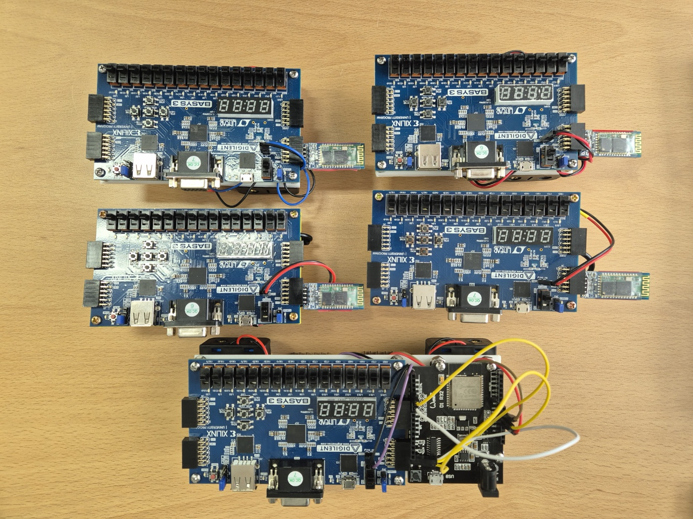

# BASYS3를 활용한 출석체크 시스템 구축
## 목적
- UART통신 활용
    - 블루투스 모듈(HC-05)를 이용하여 FPGA간 통신
- Verilog 이용 동작 구성
    - [0:4]button, led, seg7를 이용
    - 값 입력, 오답, 정답 시 동작 구현
- 16bit led 동작
    - 교사 : 학생이 출석에 성공할 경우 해당 학생의 led 점등
    - 학생 : 출결 인증번호가 맞을 경우 모든 led 점등

## 결과

- 교사 측에는 master 모드가 가능하도록 블루투스 모듈이 탑재된 아두이노 사용

### 개선 사항
- 아두이노를 이용한 순차적 연결 방식의 한계
    - 연결 성공 여부가 불확실
- STM32 보드에 HC-05를 이용한 1:1 연결 구현 필요
    - 연결 안정성 개선 기대