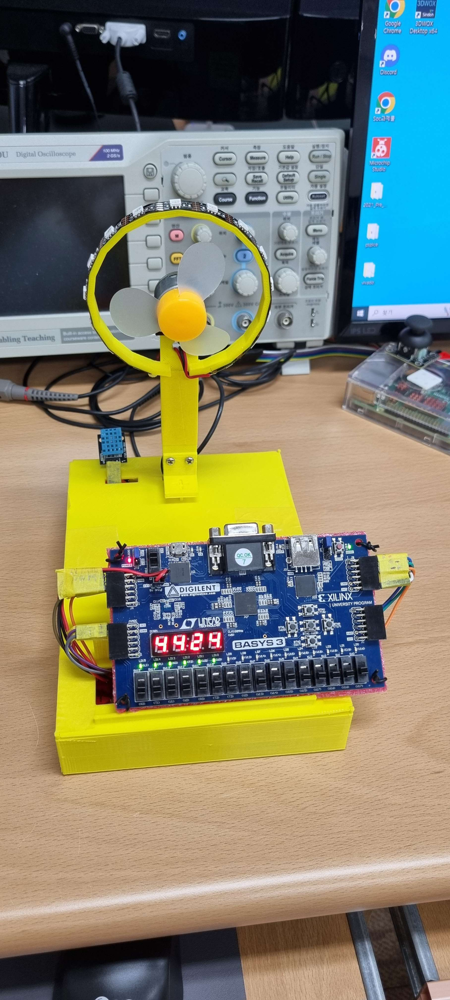

# 선풍기 제작

## 목적
- 선풍기 기능 구현
    - pwm 제어를 통한 속도 조절
    - 풍량에 따른 LED RGB 변경
- 7-segment를 이용한 표시
    - 일반 모드, DHT11을 이용한 온습도 측정값 표시
    - 시간 설정 모드, 세팅된 시간 표시
- 자연풍 구현
    - 풍량을 주기적으로 변경
- 타이머를 사용하여 설정한 시간이 지나면 선풍기 중지
    - 남은 시간을 16bit led를 이용하여 표시

## 결과

- 3D프린터를 이용하여 외관 제작