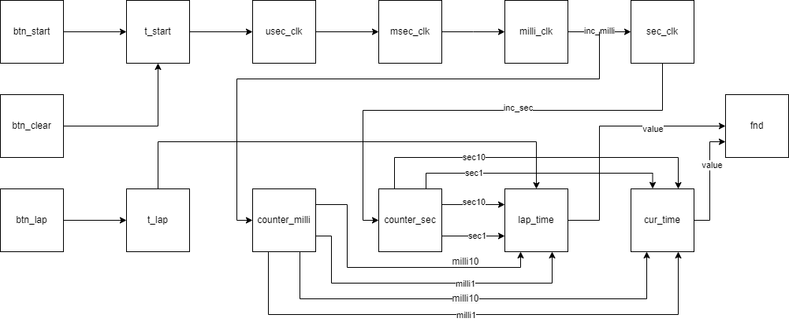
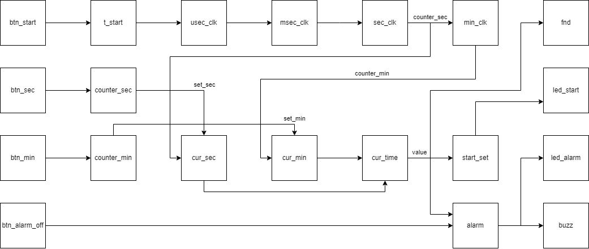

# BASYS3 FPGA를 이용한 종합 시계 제작
## 목적
- 교육과정에서 배운 Timer를 합친 Timer 제작
    - 기본 타이머 : start, stop, reset 버튼 사용

    - 스톱워치 : start, lap, stop, reset 버튼 사용

    - 알람 : start, min_set, sec_set, reset버튼, alarm off 스위치 사용

## 결과
- Mode 스위치를 이용하여 Mux를 구성
- Mode에 따른 입력, 출력 변환
- Timer, Stop, Alarm 모드 구현 성공